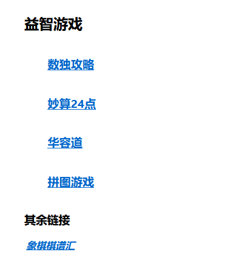
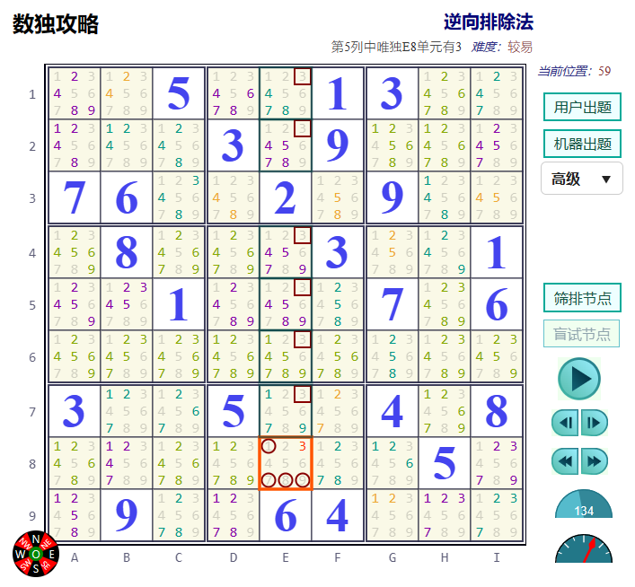
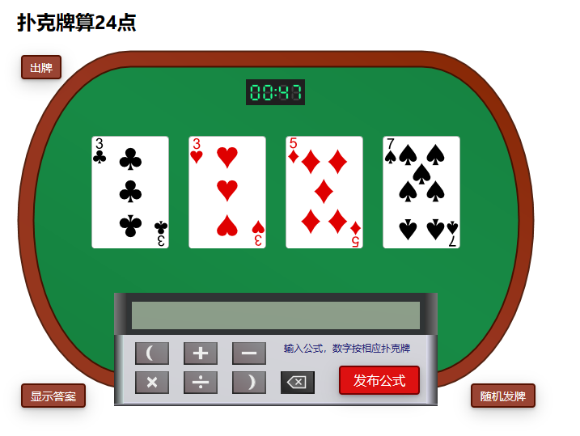
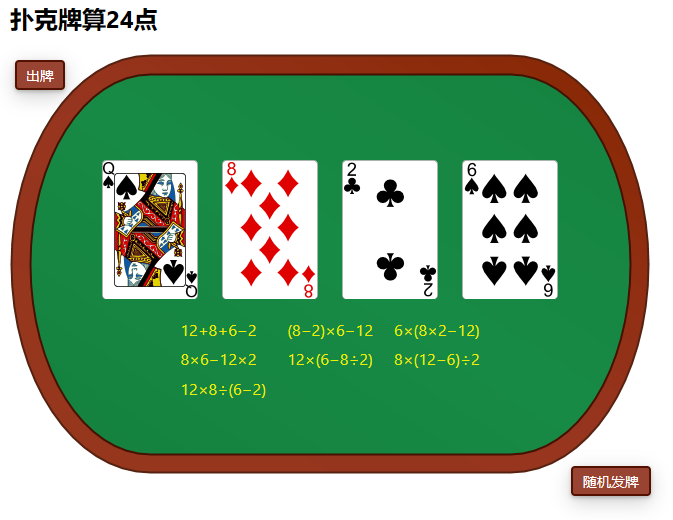
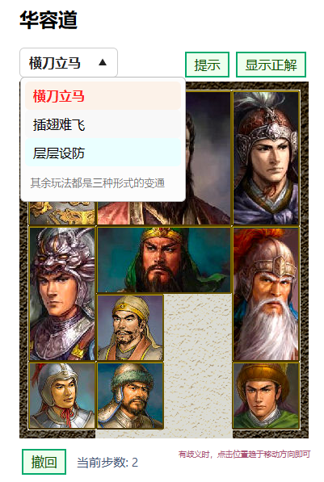
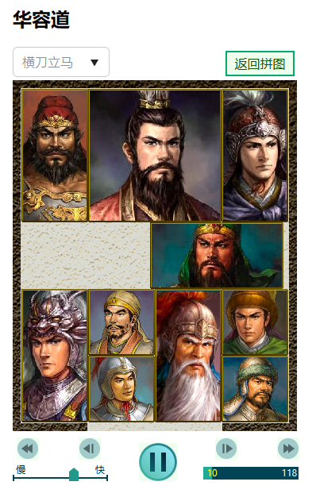
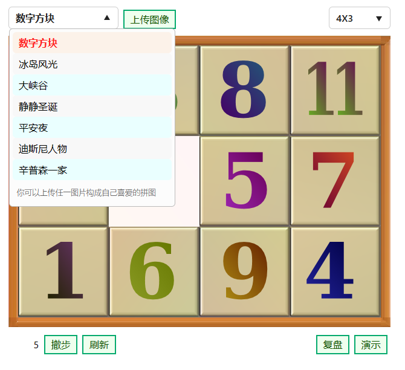
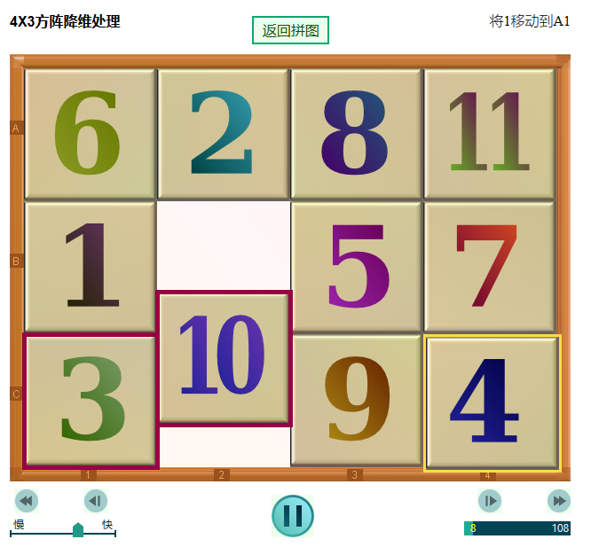

# 几个经典益智游戏

经典益智游戏是由 github 运行的静态 HTML5 应用，打开[https://mysudoku.github.io](https://mysudoku.github.io)
即进入应用首页，如下图所示。

## 应用一、数独攻略

数独是风靡各国的逻辑游戏，在老年人群体中格外流行，是阿兹海默的克星。这里的App着力于帮助大家提高解题技能。图示数独的解题步骤分为134步，每一步的解题技巧和结果都有示意图，解释得清清楚楚。

## 应用二、妙算24

由四张扑克牌算24点是又一个广受各个年龄群众团体欢迎的益智游戏。这里的App同样有帮助大家提高解题技巧的功能。“显示答案”将列出所有可能的计算方法，无一缺漏。

#### 算24点主界面

#### 算24点查看结果

## 应用三、华容道

相比于数独和算24，华容道给大家的印象应该是古代流传下来的民间游戏，实际上也是在上世纪40年代开始流传。这里的App在任何局势下都能提供最佳捷径，帮助曹操脱险。本App同一人物连续移动两格算两步，所以得出的最佳步数跟其余出处不一致。给出结果可以保证是最佳步数，由简单的breadth-first-search求得。

#### 华容道主界面

#### 华容道演示最佳途径

## 应用四、滑块拼图

滑块拼图比一般的swap puzzle难度高了许多。本App手把手教大家如何完成复原。大家可以上传任一自己喜欢的图片，构成拼图，玩得更开心。

#### 滑块拼图主界面

#### 滑块拼图辅导界面

